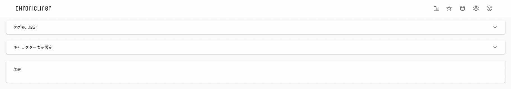
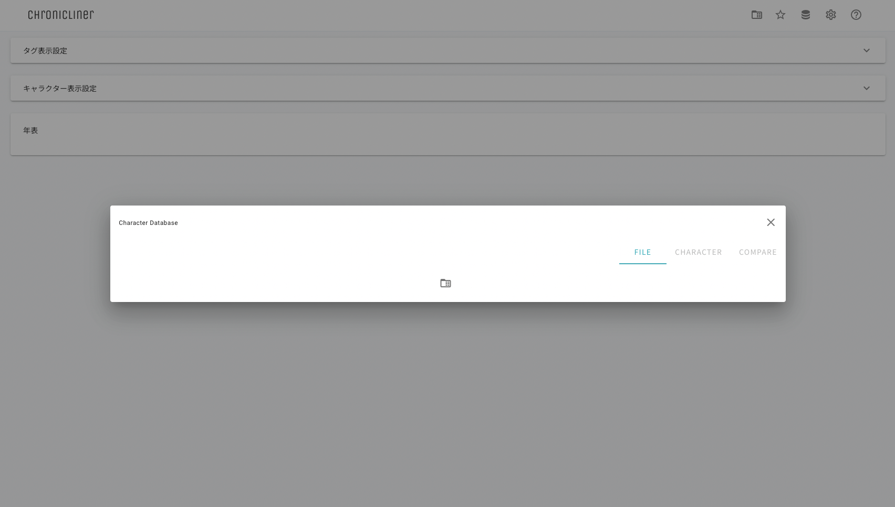
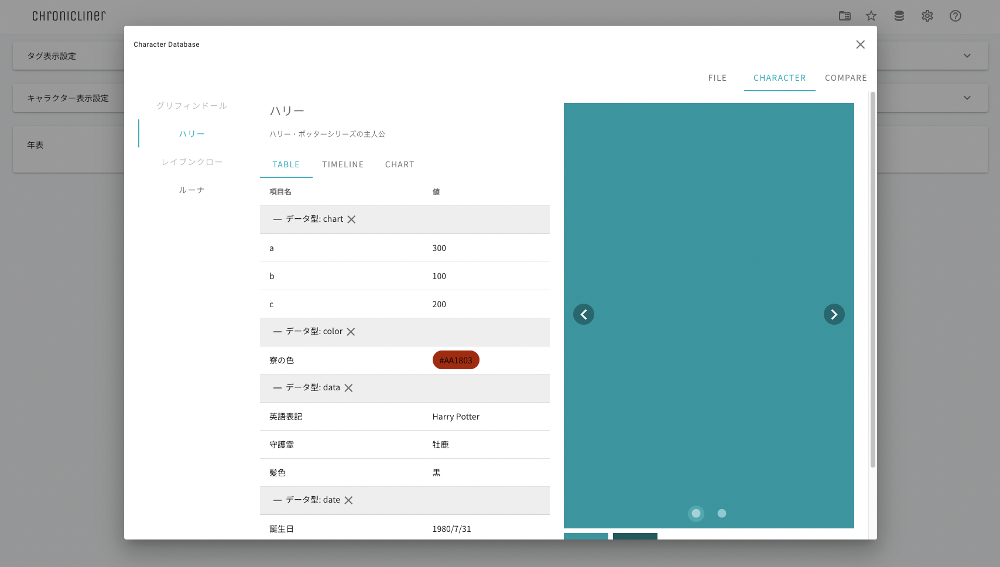

================================================
クイックスタートガイド
================================================

.. _quickstart_cdb:

1. サンプルデータの表示
=======================
以下の手順でサンプルデータを表示することができます

1. Chroniclinerフォルダの ``./app.html`` をダブルクリックする
2. ブラウザに以下画像のようなページが表示されるまで待つ

3. 右上のデータベースアイコンをクリックする
4. 以下画像のようなページが表示されるまで待つ

5. 画面中央のフォルダアイコンをクリックし、 ``./data/cdbSample.xlsx`` を選択する
6. 以下画像のようなページが表示されるまで待つ

2. 作成したデータの表示
========================================
以下の手順で任意のデータを作成し表示することができます。

1. ``./data/temp/cdbTemp.xlsx`` を任意の場所にコピーする
2. コピーしたファイルの名前を任意の名前に変更する
3. ファイルを開き、 :ref:`データの設定 <cdb_data>` を行う
4. :ref:`サンプルデータの表示 <quickstart_cdb>` と同様にファイルを読み込み表示する