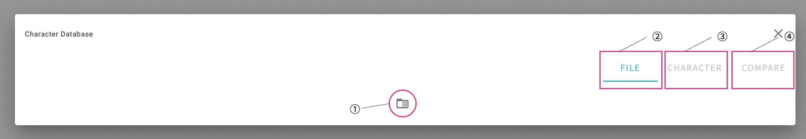
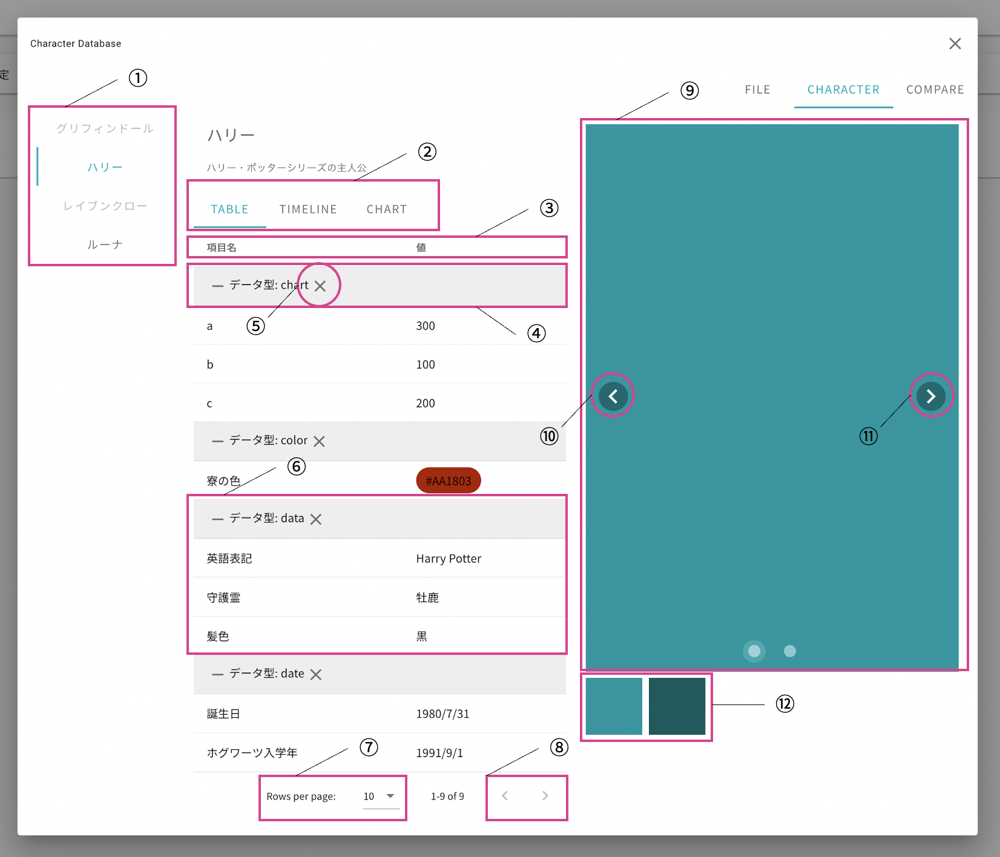
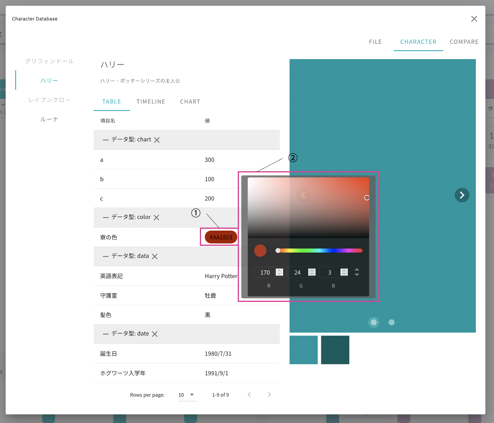
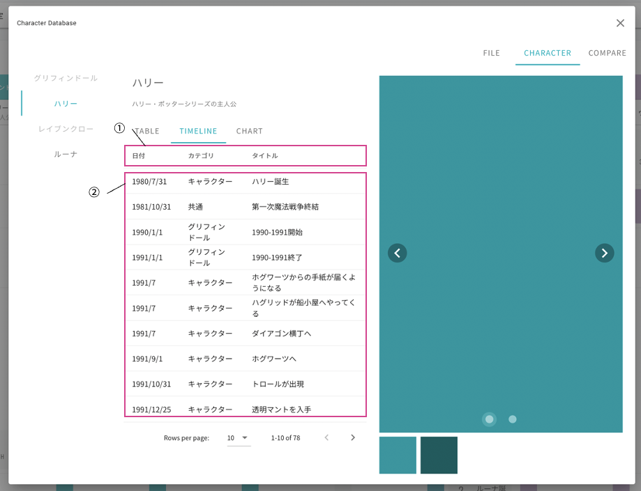
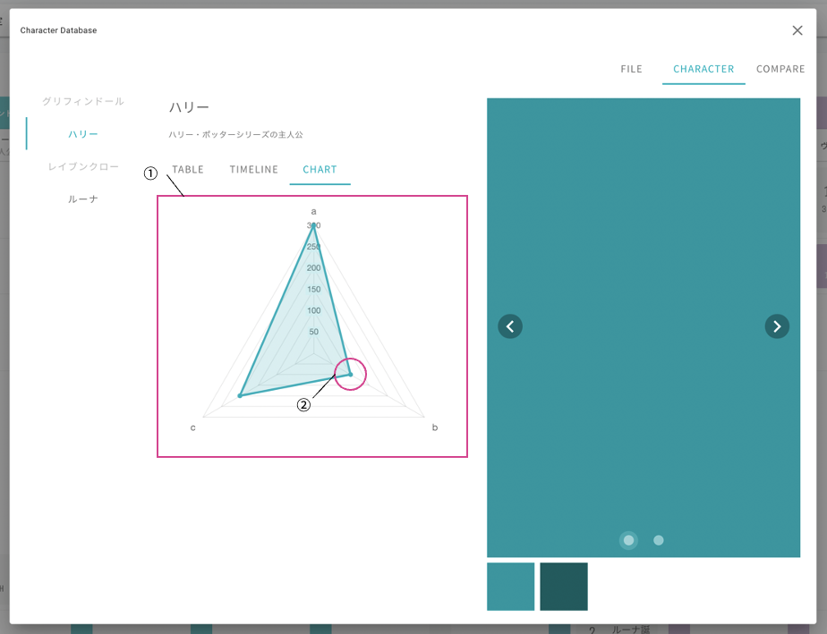
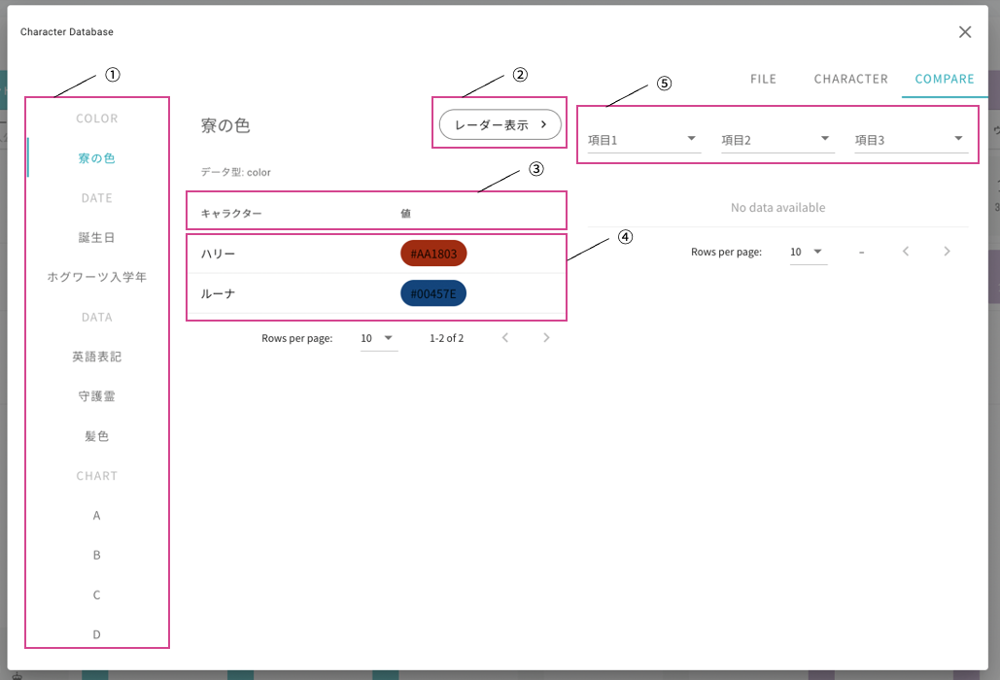
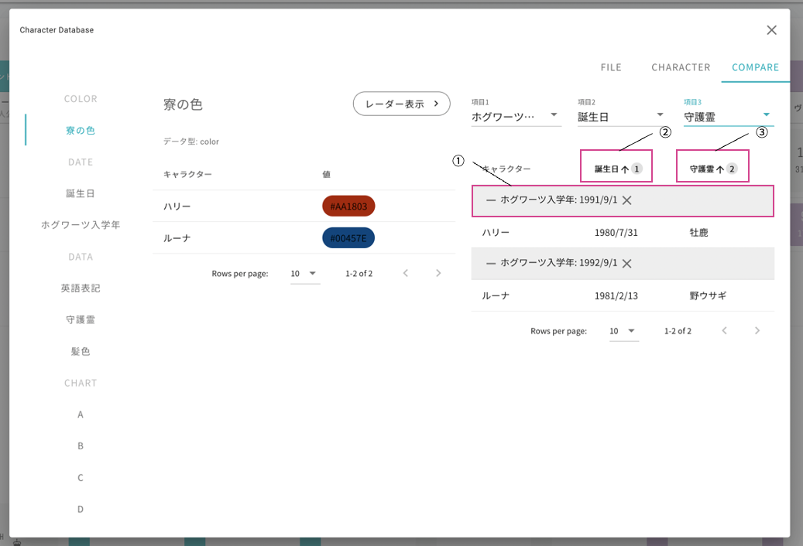
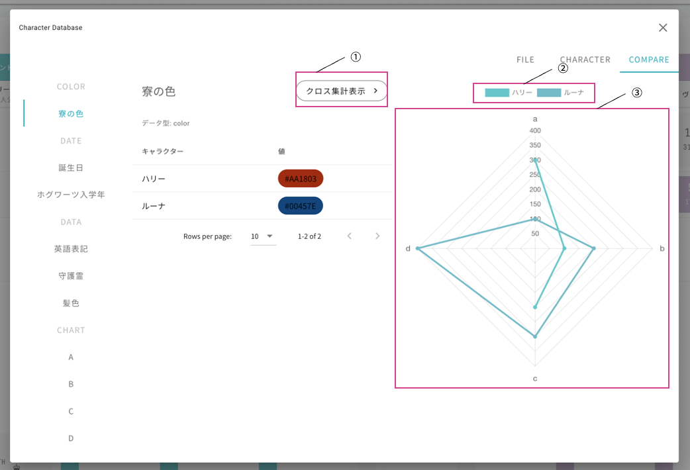

========================================
画面の各機能
========================================

1. ファイル読み込み画面
============================

.. csv-table::
    :header: "No", "名称", "使用方法", "機能"

    "1", "フォルダアイコン", "クリック", "読み込むファイルを指定する"
    "2", "ファイルタブ", "クリック", "ファイル読み込み画面を開く"
    "3", "キャラクタタブ", "クリック", ":ref:`キャラクタ詳細画面 <characterDetails>` を開く"
    "4", "比較タブ", "クリック", ":ref:`データ比較画面 <dataCompare>` を開く"

.. _characterDetails:

2. キャラクタ詳細画面
============================

2.1 データテーブル
--------------------

通常時
++++++++++++++++

.. csv-table::
    :header: "No", "名称", "使用方法", "機能"

    "1", "キャラクタ選択タブ", "クリック", "表示するキャラクタを選択する"
    "2", "表示データ選択タブ", "クリック", "表示データを切り替える"
    "3", "データテーブルヘッダー", "クリック", "列名をクリックすると当該列の値でソートする"
    "4", "データ集約行", "", "キャラクタに登録されたデータをデータ型で分けて表示する"
    "5", "データ集約解除ボタン", "クリック", "データ型でのデータ集約を解除する"
    "6", "データテーブル", "", "| 登録されたデータを表示する
    | 項目名をクリックすると比較タブの該当項目ページに遷移する"
    "7", "表示行数変更セレクター", "クリック", "1ページに表示するデータ数を選択する"
    "8", "ページ変更ボタン", "クリック", "前後ページのデータを表示する"
    "9", "画像表示領域", "", "``img`` 型で登録された画像を表示する"
    "10", "左ボタン", "クリック", "前の画像を表示する"
    "11", "右ボタン", "クリック", "次の画像を表示する"
    "12", "画像一覧", "クリック", "クリックした画像を画像表示領域に表示する"

色データ値ホバー時
+++++++++++++++++++++

.. csv-table::
    :header: "No", "名称", "使用方法", "機能"

    "1", "色チップ", "ホバー", "マウスオーバーするとカラーピッカーを表示する"
    "2", "カラーピッカー", "", "登録された色の詳細を表示する"

2.2 タイムラインテーブル
----------------------------

Chroniclinerに年表データが読み込まれており、かつ該当名のキャラクタが年表データ内に存在した場合のみ、テーブルが表示されます。
ただし、データの読み込み順を考慮する必要はありません。

.. csv-table::
    :header: "No", "名称", "使用方法", "機能"

    "1", "タイムラインテーブルヘッダー", "クリック", "列名をクリックすると当該列の値でソートする"
    "2", "タイムラインテーブル", "", "該当するキャラクタの年表データを表示する"

2.3. レーダーチャート
--------------------------

データ形式が ``graph`` で登録されたデータを使用し、レーダーチャートを作成・表示します。

.. csv-table::
    :header: "No", "名称", "使用方法", "機能"

    "1", "レーダーチャート表示領域", "", "レーダーチャートを表示する"
    "2", "ポイント", "ホバー", "マウスオーバーするとデータの値をポップアップで表示する"

.. _dataCompare:

3. データ比較画面
=========================

3.1. 集計対象未選択時
-------------------------------------

.. csv-table::
    :header: "No", "名称", "使用方法", "機能"

    "1", "データ項目選択タブ", "クリック", "表示するデータ項目を選択する"
    "2", "レーダーチャート表示ボタン", "クリック", "右側集計表をレーダーチャート表示に切り替える"
    "3", "比較テーブルヘッダー", "クリック", "列名をクリックすると当該列の値でソートする"
    "4", "比較テーブル", "クリック", "| タブで選択された項目が登録されたキャラクタとその値を一覧表示する
    | キャラクタ名をクリックするとキャラクタ詳細ページに遷移する"
    "5", "集計データ選択セレクタ", "クリック", "| 比較したいデータ項目を3つまで選択する
    | ``category`` 、 ``caption`` 、 ``img`` のデータは選択対象外"

3.2. 集計対象選択時
-------------------------------

集計データ選択セレクタで比較したい項目を3つまで選択することで、各キャラクタに登録された値を比較することができます。選択された項目がすべて存在しないキャラクタの表示は省略されます。

.. csv-table::
    :header: "No", "名称", "使用方法", "機能"

    "1", "項目1表示領域", "", "項目1に登録されたデータをグループ化して表示する"
    "2", "項目2表示列", "", "| 項目2に登録されたデータを表示する
    | ソートのメインキーになる"
    "3", "項目3表示列", "", "| 項目3に登録されたデータを表示する
    | ソートのサブキーになる"

3.3. レーダーチャート表示時
-------------------------------

各キャラクタに登録された ``graph`` 形式データをレーダーチャートで表示します。ある項目が登録されたキャラクタと登録されていないキャラクタが存在する場合、登録されていないキャラクタの当該項目のポイントは表示されません。

.. csv-table::
    :header: "No", "名称", "使用方法", "機能"

    "1", "集計表表示ボタン", "クリック", "右側レーダーチャートをデータ集計表表示に切り替える"
    "2", "キャラクタ凡例", "クリック", "キャラクタの表示・非表示を切り替える"
    "3", "レーダーチャート表示領域", "", "レーダーチャートを表示する"