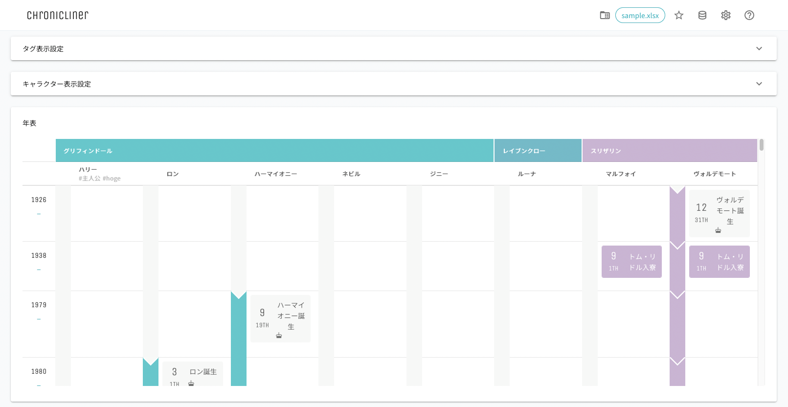

========================================
クイックスタートガイド
========================================

.. _quickstart_display:

1. サンプルデータの表示
==========================
以下の手順でサンプルデータを表示することができます。

1. Chroniclinerフォルダの ``./app.html`` をダブルクリックする
2. ブラウザに以下画像のようなページが表示されるまで待つ

.. image:: ../../img/quickstart_nofile.png
   :alt: 初期画面

3. 右上のフォルダアイコンをクリックし、 ``./data/sample.xlsx`` を選択する
4. 以下画像のようなページが表示されるまで待つ

2. 作成したデータの表示
========================================
以下の手順で任意のデータを作成し表示することができます。

1. ``./data/temp/template.xlsx`` を任意の場所にコピーする
2. コピーしたファイルの名前を任意の名前に変更する
3. ファイルを開き、各ページを参照しながらデータの設定を行う

   + :doc:`../data/category`
   + :doc:`../data/character`
   + :doc:`../data/school`
   + :doc:`../data/event`
   + :doc:`../data/periodEvent`

4. :ref:`サンプルデータの表示 <quickstart_display>` と同様にファイルを読み込み表示する