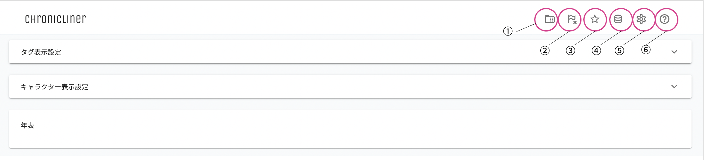
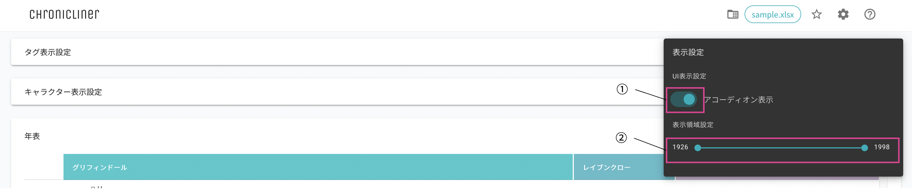
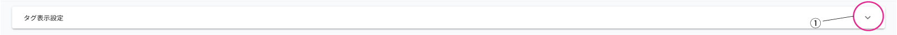
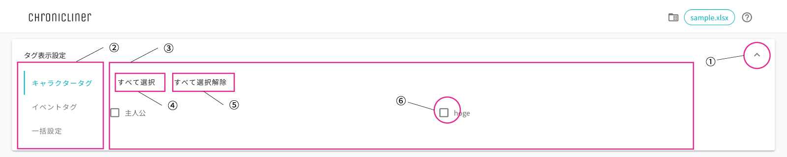
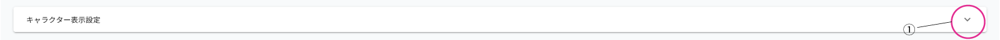
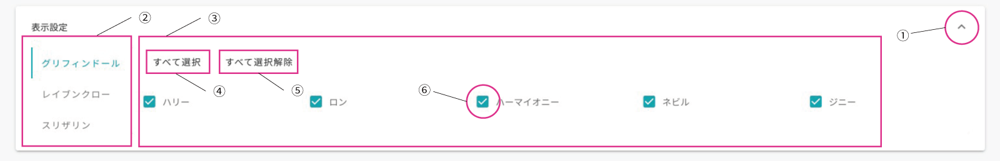
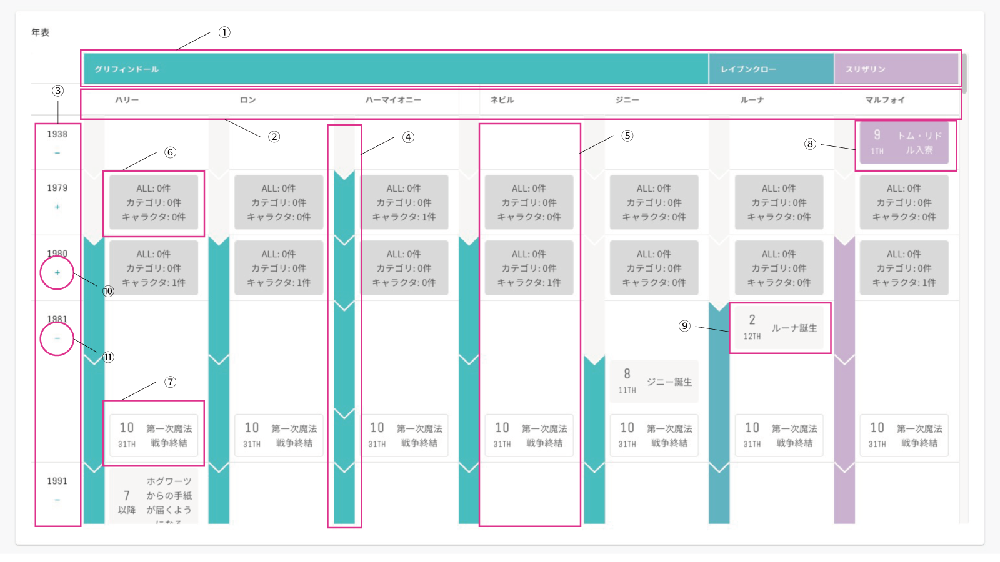

========================================
画面の各機能
========================================

1. メニューバー
========================================

.. csv-table::
    :header: "No", "名称", "使用方法", "機能"

    "1", "フォルダアイコン", "クリック", "読み込むファイルを指定する"
    "2", "フラグ未回収アイコン", "クリック", "フラグ未回収イベント一覧パネルを開く/閉じる"
    "3", "重要イベントハイライト切り替えアイコン", "クリック", "重要イベントハイライトモードをON/OFFにする"
    "4", "データベースアイコン", "クリック", "キャラクターデータベースを表示する"
    "5", "設定アイコン", "クリック", "表示設定パネルを開く/閉じる"
    "6", "ヘルプアイコン", "クリック", "Chroniclinerのドキュメント（これ）を開く"

2. 表示設定パネル
========================================

.. csv-table::
   :header: "No", "名称", "使用方法", "機能"

   "1", "アコーディオン表示トグルボタン", "クリック", "タグ表示設定アコーディオン、キャラクター表示設定アコーディオンの表示状態をトグルする"
   "2", "年表示範囲指定スライダー", "ドラッグ", "年表の表示年領域をスライダーで指定された範囲に制限する"

.. note::
   データ読み込み後に操作可能になります

3. タグ表示設定アコーディオン
================================================================
折りたたみ状態
----------------------------------------------------------------

.. csv-table::
    :header: "No", "名称", "使用方法", "機能"

    "1", "", "クリック", "表示設定のアコーディオンを展開する"

展開状態
----------------------------------------------------------------
キャラクター / イベントタブ
++++++++++++++++++++++++++++++++++++++++++++++++

.. csv-table::
    :header: "No", "名称", "使用方法", "機能"
    :widths: 20, 30, 30, 50

    "1", "", "クリック", "表示設定のアコーディオンを折りたたむ"
    "2", "カテゴリ選択タブ", "クリック", "選択フィールドに表示するカテゴリを切り替える"
    "3", "選択フィールド", "", "キャラクター / タグの表示切り替えボタンを表示する"
    "4", "すべて選択ボタン", "クリック", "すべてのタグを選択状態にする"
    "5", "すべて選択解除ボタン", "クリック", "タグでの絞り込み状態を解除する"
    "6", "表示切り替えボタン", "クリック", "該当タグの選択状態を切り替える"

一括設定タブ
++++++++++++++++++++++++++++++++++++++++++++++++
タグ一括設定モードでは、選択したタグのキャラクターの選択したタグが付与されたイベントのみが表示されます。

キャラクターのみに付与されたタグ、イベントのみに表示されたタグのみを選択した場合、タイムラインは表示されなくなります。

.. image:: ../../img/usage_6.png
   :alt: アコーディオン展開

.. csv-table::
    :header: "No", "名称", "使用方法", "機能"
    :widths: 20, 30, 30, 50

    "1", "", "クリック", "表示設定のアコーディオンを折りたたむ"
    "2", "カテゴリ選択タブ", "クリック", "キャラクター選択フィールドに表示するカテゴリを切り替える"
    "3", "キャラクター選択フィールド", "", "選択カテゴリのキャラクターの表示切り替えボタンを表示する"
    "4", "一括設定トグル", "クリック", "オンの場合、選択したタグが付与されたキャラクターの選択したタグが付与されたイベントのみを表示する"

4. キャラクター表示設定アコーディオン
========================================
折りたたみ状態
--------------

.. csv-table::
    :header: "No", "名称", "使用方法", "機能"

    "1", "", "クリック", "表示設定のアコーディオンを展開する"

展開状態
-------------------------------

.. csv-table::
    :header: "No", "名称", "使用方法", "機能"
    :widths: 20, 30, 30, 50

    "1", "", "クリック", "表示設定のアコーディオンを折りたたむ"
    "2", "カテゴリ選択タブ", "クリック", "キャラクター選択フィールドに表示するカテゴリを切り替える"
    "3", "キャラクター選択フィールド", "", "選択カテゴリのキャラクターの表示切り替えボタンを表示する"
    "4", "すべて選択ボタン", "クリック", "カテゴリのキャラクター全員を表示状態にする"
    "5", "すべて選択解除ボタン", "クリック", "カテゴリのキャラクター全員を非表示状態にする"
    "6", "表示切り替えボタン", "クリック", "該当キャラクターの表示状態を切り替える"

5. 年表
================================================================

.. csv-table::
    :header: "No", "名称", "使用方法", "機能"

    "1", "カテゴリー行", "", "キャラクターのカテゴリを表示する"
    "2", "キャラクター行", "クリック", "| カテゴリのキャラクターを表示する
    | 該当キャラクタをキャラクターデータベースに読み込んでいる場合、キャラクタ名をクリックするとキャラクターデータベースの該当ページを開く"
    "3", "年表示列", "", "イベントが存在する年を表示する"
    "4", "タイムライン列", "ホバー", "| 年齢が切り替わるタイミングで区切りを入れた矢印を表示する
    | ホバーするとキャラクター名、年齢、学校名、学年、設定された期間イベントを表示する"
    "5", "イベントカード列", "", "キャラクターのイベントカードを表示する"
    "6", "サマリーカード", "", "| 該当年を折りたたんでいる場合、その年のイベント数を表示する
    | 表示年範囲を制限している場合、非表示の年範囲のイベント数を集計して表示する"
    "7", "イベントカード（共通）", "ホバー", "| 全員に共通するイベントの情報を表示する
    | ホバーすると設定された詳細情報を表示する"
    "8", "イベントカード（カテゴリ）", "ホバー", "| カテゴリに共通するイベントの情報を表示する
    | ホバーすると設定された詳細情報を表示する"
    "9", "イベントカード（キャラクター）", "ホバー", "| キャラクターのイベントの情報を表示する
    | ホバーすると設定された詳細情報を表示する"
    "10", "折りたたみボタン", "クリック", "該当年の年表を折りたたむ"
    "11", "展開ボタン", "クリック", "該当年の年表を展開する"

.. note::
   イベントが該当キャラクターの誕生日と同日に設定されていた場合、ケーキのアイコンが表示されます。

.. note::
   イベントが重要イベントに指定されている場合、星のアイコンが表示されます。

.. note::
   イベントがフラグイベントの場合、黒塗りのフラグアイコンが表示されます。ただし、フラグが未回収時のフラグ回収期間終了イベント、及び、回収期間超過後のフラグ解消イベントには、白抜きのフラグにバツ印のアイコンが表示されます。